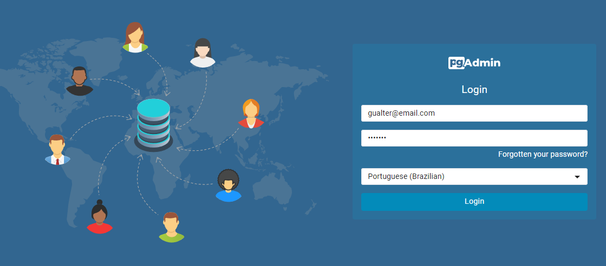
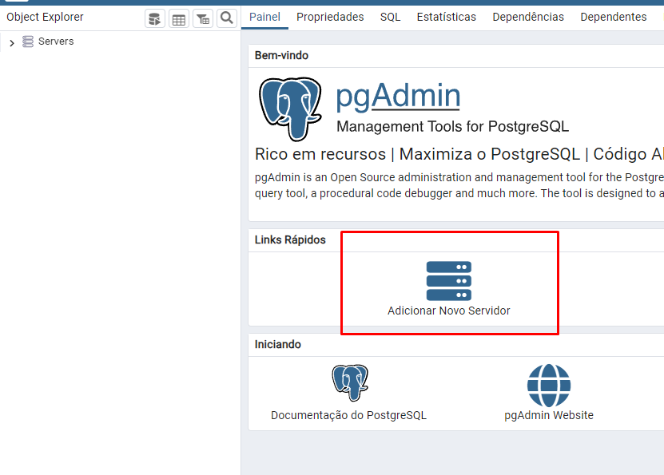
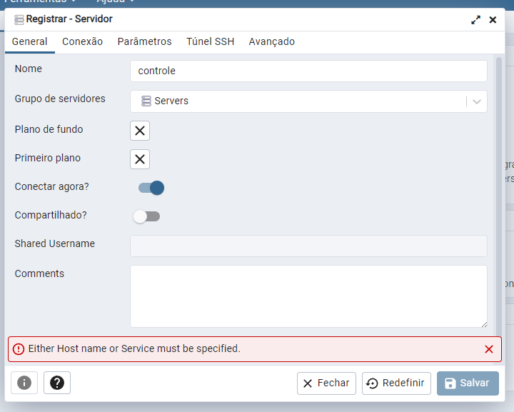
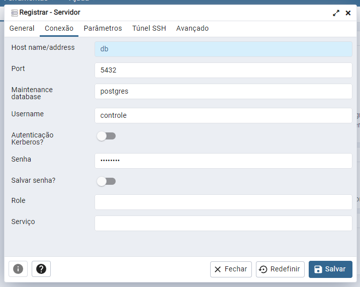
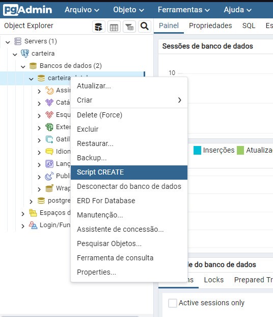

  
 ## Carteira de Investimentos
  

## 📁 Informações do projeto:

- O projeto se trata de uma carteira de investimentos que permite ao usuario registrar todas as suas transações realizadas, contendo seu tipo de transação (Compra ou Venda), bem como qual o tipo de ativo (Ações, FIIs, ETFs e BDRs). Além disso, a aplicação possui uma tabela derivada nomeada de "Carteira".Periodamente ocorrerá a rotina de calculo que atualizará os dados dessa tabela, contendo informações relevantes que permitirão ao usuário visualizar seu patrimonio por ativo, bem como o patrimonio total.
  

## ✔️ Requisitos:
- Possuir o Docker Desktop instalado e devidamente configurado
- Possuir alguma Application Programming Interfaces, preferencialmente o POSTMAN devido as collections que acompanham os arquivos do projeto
- Recomandado o uso da IDE IntelliJ IDEA

## ▶️ Utilização do projeto:

- Para utilização do projeto deve-se seguir os seguintes passos:

1. Após clonar o repositorio e abrir na IDE execute os comandos:

2.  `./gradlew build` para gerar os artefatos do projeto (.jar)
*Obs:* Caso ele apresente erro, pode prosseguir.

3. `docker build -t controle-image .` para buildar a imagem docker 

4. `docker-compose up -d ` para inicializar e subir os containers

5. Feito isso, será necessario que acesse o pgAdmin (SBD escolhido) no proprio navegador pelo link: `http://localhost:8081/browser/`

6. Ao acessar, deverá informar as credenciais de acesso ao painel administrativo:

7. email: `gualter@email.com` senha: `gualter` 
 *Obs* : Não utilizei variaveis de ambiente para facilitar o processo e correção do projeto.

    

8. Ao acessar, deve clicar em ADICIONAR NOVO SERVIDOR. A seguir os passos:

    

9. Aba Geral - Nome: `carteira`

    

10. Aba Conexão - Host: `db`, Port:`5432`, Username: `carteira`, Password: `carteira`

    

11. Ao clicar em salvar, se todos os dados estiverem corretos você conseguirá conectar com sucesso.

12. Feito isso,a proxima etapa é a de criação da tabela. O script SQL estará disponivel ao fim dessa página e dentro da pasta *documents* do proprio projeto.

13. No menu lateral esquerdo abra na ordem `carteira -> databases -> carteira-database`

14. Clique com botão direito do mouse sobre ele e selecione a opção `SCRIPT CREATE`

    

15. Na janela que se abre apague TODO o conteudo e colo o script de criação do banco citado anteriormente. 
*Obs:* Será necessario executar bloco de comando a bloco de comando.

16. Feito isso, execute a aplicação (API) pela propria IDE, NÃO utilize a do Docker Desktop
*Motivo:* Devido a alguma incompatibilidade com a versão JAVA ela não está rodando dentro do container, mas fora funciona normalmente.

Após realizar esses passos,a API estará em execução e será possivel realizar as requisições.

## ⚙️ Tecnologias utilizadas

- `Kotlin`
- `Spring`
- `Postgres`
- `Docker`

## ⚙️ Modelo Entidade Relacionamento(DER):

  

 

## 💾 Script de criação das tabelas:

  

 

## 🧭 Contrato de rotas da API:

  

